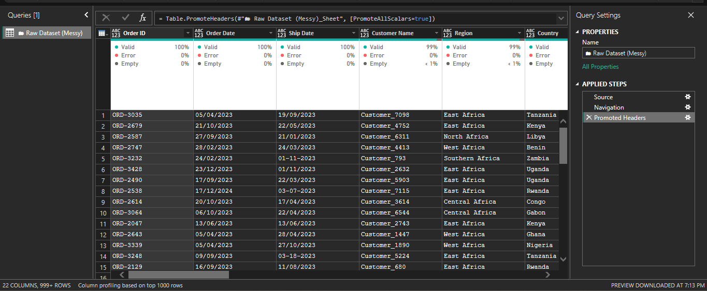
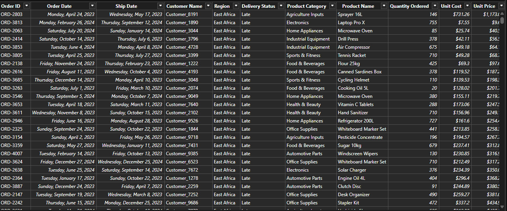

# GlobalMart Supply Chain Analytics

# Project Overview

The GlobalMart Superstore Supply Chain Analytics is an interactive Power BI dashboard built to help business stakeholders make better decisions using data. The goal of this project was to transform raw sales and operational data into a clean, interactive reporting solution that provides insights into revenue, profitability, supplier performance, inventory, and logistics.

Rather than building a single dashboard, I designed a two-page, app-like experience that allows users to switch between different business areas while keeping the interface intuitive and easy to navigate. The report includes interactive filters, dynamic KPIs, custom DAX measures, page navigation, and bookmark functionality to create a seamless user experience.

This project also demonstrates the complete Business Intelligence workflow—from cleaning messy data in Power Query to building data models, writing DAX measures, designing dashboards, and communicating business insights.

# Business Objectives
This project was designed to answer a few key business questions:

1. How is the business performing financially?

2. Which products and suppliers contribute the most value?
   
3. Are deliveries meeting customer expectations?
   
5. Which areas of the supply chain need improvement?
   
7. How can business leaders use data to make better decisions?

**Tools Used**

Power BI Desktop

Power Query

DAX

Microsoft Excel

Power BI Bookmarks

# About the Dataset

The project uses the GlobalMart Superstore dataset, which contains sales and operational information such as:

Customer Orders

Revenue and Profit

Suppliers

Countries and Regions

Product Categories

Shipping Modes

Order and Ship Dates

Stock Levels

Ordered Quantities

Damaged Goods

Since the dataset wasn't perfectly clean, a significant amount of time was spent preparing the data before any visualizations were created.

[📁 Download Power BI Report File](./GLOBAL%20SUPERSTORE%20DATA.pbix)

# Data Cleaning & Transformation

Before building the dashboards, I focused on making sure the data was accurate, consistent, and suitable for analysis. Several issues were identified during the cleaning process.

**Mixed Date Formats**

One of the first challenges I encountered was inconsistent date formatting. Both the Order Date and Ship Date columns contained multiple formats, including DD/MM/YYYY, MM/DD/YYYY, and entries that only contained the month and year.
Trying to convert the entire column using a single locale resulted in conversion errors.

To solve this, I created new cleaned date columns in Power Query using a try...otherwise expression that attempted multiple date formats until a valid date was found. Instead of modifying the original columns, I kept them for validation purposes.
This approach allowed me to standardize all valid dates while preserving the original source data.

**Invalid Shipping Timelines**

While validating the dates, I noticed that some records showed the Ship Date occurring before the Order Date, which isn't logically possible.
Rather than deleting or altering those records, I created a validation column that flagged these anomalies for review. This ensured that shipping metrics such as Days to Ship were calculated using reliable data while maintaining transparency.

**Cleaning Text Fields**

Another challenge involved inconsistent text values across several categorical columns.
Some supplier names contained spelling variations, extra spaces, hidden characters, or duplicated words. For example, supplier names that referred to the same company appeared as separate categories because of formatting inconsistencies.
Using Power Query, I applied Trim, Clean, Capitalize Each Word, and carefully targeted Replace Values operations to standardize these fields. This improved the accuracy of filters, visualizations, and aggregations throughout the report.

**Numerical Formatting**

Some of the numerical columns also required attention.
Revenue values displayed unnecessary decimal places, and certain numeric fields had inconsistent data types that could affect calculations.
These columns were converted to the appropriate numeric formats, and custom display formatting was applied to present large currency values in a cleaner, more readable format.

**Data Modeling & DAX**

Once the data was cleaned, I created several DAX measures to calculate the KPIs used throughout the dashboards.
These included:

Financial Metrics

Total Revenue

Total Profit

Profit Margin

Average Order Value

Logistics Metrics

Total Orders

Average Days to Ship

On-Time Delivery Rate

Late Delivery Rate

Operational Metrics

Damaged Goods Rate

Damaged Goods Count

These measures allowed the dashboards to respond dynamically to slicers and user interactions.

#### Uncleaned Dataset (Raw)

*Raw dataset containing inconsistent date formats, vendor name variations, and unformatted numbers.*

#### Cleaned Dataset

*Standardized dataset following Power Query cleaning, date validation, and field formatting.*

# Dashboard & Business Insights

**Dashboard 1 — Operations & Logistics**

The Operations dashboard focuses on the performance of the company's logistics and supply chain.
It brings together delivery performance, supplier efficiency, inventory management, and damaged goods into a single view, making it easier to identify operational bottlenecks.

**KPIs**

Total Revenue

On-Time Delivery Rate

Late Delivery Rate

Average Days to Ship

Damaged Goods Rate

**Visuals**

Late Delivery Rate by Supplier

On-Time Delivery Rate by Shipping Mode

Damaged Goods Rate by Product Category

Monthly Delivery Performance Trend

Stock Level vs Ordered Quantity

**Key Insights**

Only 34.38% of deliveries were completed on time, while 66.82% were delivered late. This suggests that delivery performance is a major area requiring attention and could have a direct impact on customer satisfaction.
Among the available shipping options, Express shipping consistently achieved the best on-time performance, while Economy shipping recorded the lowest reliability.

Supplier performance also varied considerably. Some suppliers experienced much higher late delivery rates than others, indicating opportunities to review supplier performance or strengthen service level agreements.
Inventory levels generally remained above customer demand across most product categories. While this helps reduce stockouts, it may also increase inventory holding costs if left unmanaged.

Damaged goods accounted for only 2.5% of products overall, suggesting that handling processes are generally effective, although a few product categories experienced slightly higher damage rates.

**Recommendations**

The company should:

1. Investigate the causes of late deliveries and improve logistics planning.

2. Increase the use of shipping methods that consistently deliver on time.

3. Monitor supplier performance regularly using delivery scorecards.

4. Review inventory policies to balance stock availability with carrying costs.

5. Focus on product categories with higher damage rates to improve packaging and handling.

**Dashboard 2 — Business Performance & Profitability**

The Business Performance dashboard provides a high-level view of the company's financial health.
It focuses on revenue, profit, product performance, supplier contribution, and regional performance to help business leaders understand where value is being created.

**KPIs**

Total Revenue

Total Profit

Profit Margin

Total Orders

Average Order Value

**Visuals**

Revenue vs Profit by Product Category

Profit Margin by Product Category

Revenue Contribution by Region

Top 10 Suppliers by Profit Contribution

Monthly Revenue Trend Analysis

**Key Insights**

The business generated approximately $717 million in revenue and $199 million in profit, resulting in an overall profit margin of 27.74%. This indicates that the business remains profitable despite operational challenges.

Not every product category contributes equally to profitability. Some categories generate high revenue but comparatively lower profit margins, suggesting opportunities to improve pricing strategies or reduce operational costs.

East Africa emerged as the strongest-performing region by revenue, with West Africa and Central Africa following closely behind.
The supplier analysis revealed that a relatively small group of suppliers contributes a significant portion of overall profit, highlighting the importance of maintaining strong supplier relationships while reducing dependency on a few key partners.

The monthly revenue trend also showed noticeable fluctuations throughout the reporting period, suggesting that seasonality or changes in customer demand may be influencing sales performance.

**Recommendations**

The Company should:

1. Invest more in product categories with strong profit margins.

2. Review lower-margin categories to identify opportunities for cost reduction or pricing improvements.

3. Continue strengthening relationships with top-performing suppliers while diversifying the supplier base.

4. Replicate successful sales strategies from high-performing regions in other markets.

5. Use historical revenue trends to improve demand forecasting and inventory planning.

## Project Presentation

In addition to the interactive Power BI report, I created an executive presentation that summarizes the project's objectives, data preparation process, dashboard insights, and business recommendations.

**Download the presentation here:**

[Download Project Presentation (PPTX)](./Aleemat_Agboola_Global%20Superstore.pptx)

